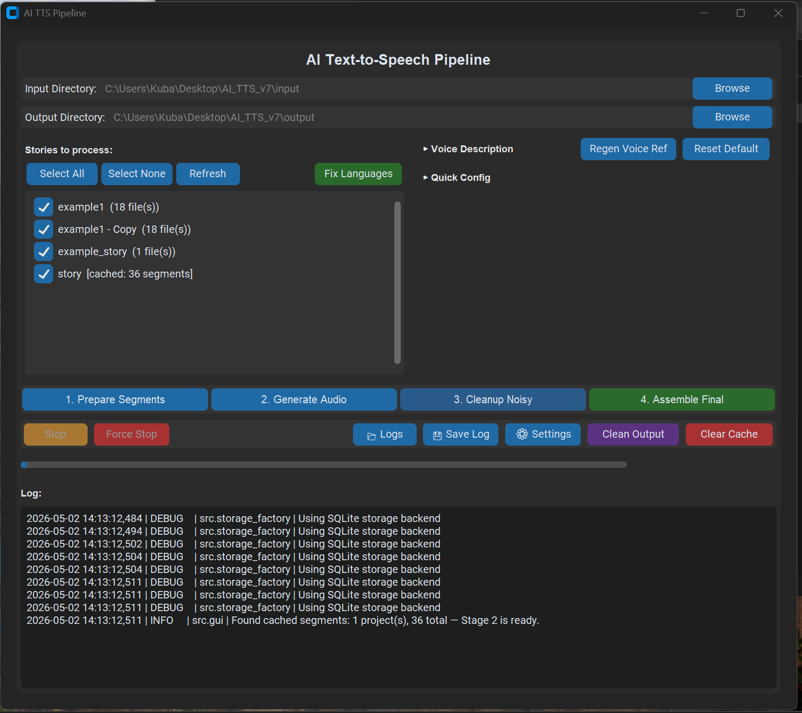
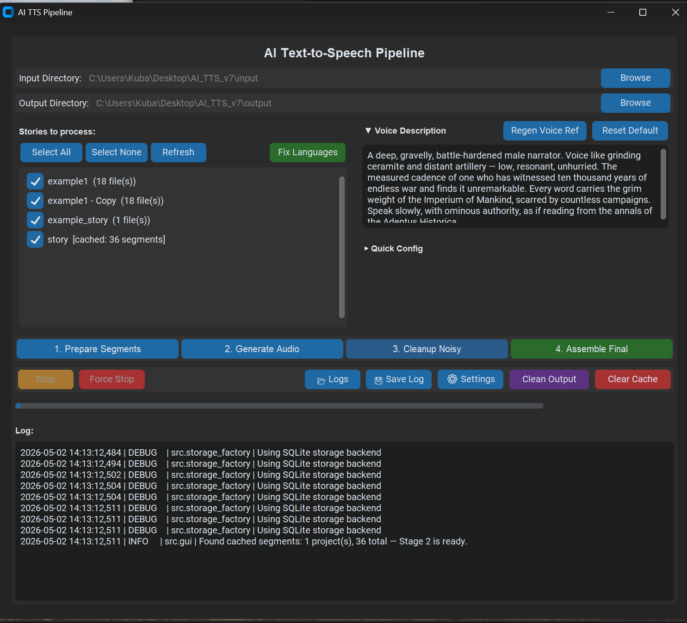
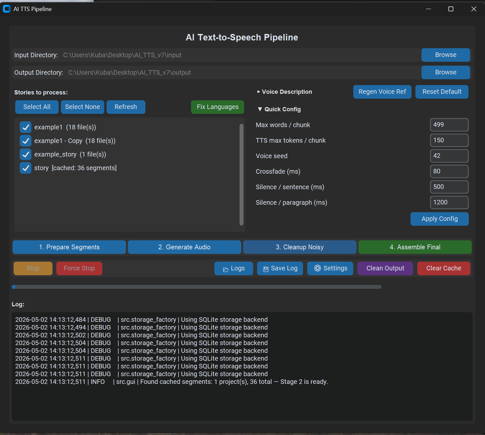
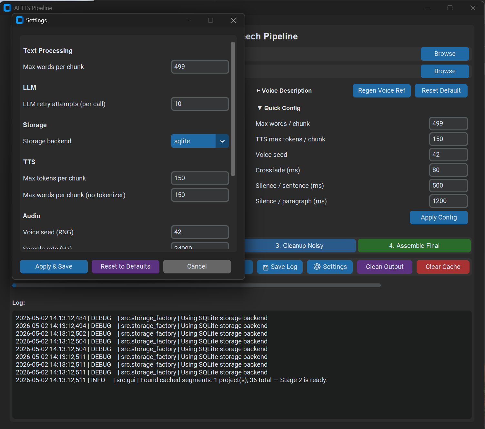

# text-to-audiobook - Advanced Text-to-Speech Application

A powerful, open-source text-to-speech application powered by state-of-the-art AI models. This project combines the Qwen3-TTS model with intelligent text processing to deliver high-quality, natural-sounding audio generation with a modern desktop interface.

## ✨ Features

- 🎤 **Advanced TTS Engine**: Built on Qwen3-TTS for high-quality voice synthesis
- 🧠 **Intelligent Text Processing**: LLM-powered text normalization and chunking
- 🎨 **Modern GUI**: CustomTkinter-based interface with real-time progress tracking
- ⚡ **Optimized Audio Pipeline**: Multi-stage audio processing with noise reduction and crossfading
- 💾 **Flexible Storage**: Support for both SQLite and JSON storage backends
- 🔄 **Caching System**: Intelligent caching of processed segments for faster regeneration
- 🎛️ **Configurable Settings**: Easy-to-customize audio parameters via JSON config
- 📊 **Comprehensive Testing**: Full test suite with 100% mock-based unit tests

## 📸 Screenshots

### Main Interface



The primary GUI for text input and project management. Features intuitive file selection, progress tracking, and real-time feedback.

### Voice Prompt



Define custom voice characteristics with the narrator prompt interface. Customize the voice personality and tone for your audiobook generation.

### Quick Settings



Access quick adjustments for audio processing parameters. Fine-tune settings on-the-fly during text normalization and audio generation.

### Settings Window



Comprehensive settings configuration panel. Adjust all audio parameters, output formats, chunk sizes, and processing options in one place.

## System Requirements

- **GPU** (Optional): NVIDIA GPU with CUDA support (RTX 4070 tested, 8 GB VRAM minimum)
- **CPU**: Quad-core or better
- **RAM**: 16 GB minimum (8 GB minimum with smaller models)
- **Disk**: 20 GB free (for models + output)
- **OS**: Windows 11, Ubuntu 20.04+, macOS 12+
- **Python**: 3.8 or higher
- **ffmpeg**: Optional, for MP3 export

## Installation

### 1. Install ffmpeg

**Windows (via Chocolatey)**:
```bash
choco install ffmpeg
```

**Ubuntu/Debian**:
```bash
sudo apt-get install ffmpeg
```

**macOS**:
```bash
brew install ffmpeg
```

### 2. Clone and setup

```bash
cd text-to-audiobook
python -m venv venv
source venv/bin/activate  # Windows: venv\Scripts\activate
pip install -r requirements.txt
```

### 3. Set up Hugging Face token (optional for public models)

```bash
# Set HF_TOKEN for automatic model downloads
export HF_TOKEN=hf_xxxxxxxxxxxxxxxxxxxxxx  # macOS/Linux
set HF_TOKEN=hf_xxxxxxxxxxxxxxxxxxxxxx     # Windows CMD
$env:HF_TOKEN="hf_xxxxxxxxxxxxxxxxxxxxxx"  # Windows PowerShell
```

Get your token from [Hugging Face Settings](https://huggingface.co/settings/tokens).

**Models are downloaded automatically on first run:**

- Llama-3.2-1B-Instruct (Q4_K_M) → `models/`
- Qwen3-TTS-1.7B → HF home cache (auto-managed by transformers)

## Usage

### GUI Mode (Recommended)

```bash
python main.py
```

The GUI will open. Select input and output directories, then click **Start Processing**.

### Programmatic Mode

```python
from src.pipeline import run
from pathlib import Path

run(
    input_dir=Path("input"),
    output_dir=Path("output"),
    progress_cb=lambda msg: print(msg)
)
```

## Input Format

Place Markdown files in the `input/` directory. Files are discovered and sorted alphanumerically. Supported Markdown:
- Headers (`#`, `##`, etc.) — stripped
- **Bold**, *italic*, `inline code` — formatting removed, text preserved
- Links `[text](url)` — link text preserved, URL removed
- Code fences (` ``` `) — stripped entirely
- Paragraphs (separated by blank lines) — preserved

Example: `input/example_story.md`

## Output Structure

```
output/
├── final/
│   ├── audiobook.mp3          # Final audio
│   └── audiobook.wav          # WAV mirror
└── chunks/
    ├── chunk_000000.wav
    ├── chunk_000001.wav
    └── ...
```

## Configuration

Edit `src/config.py` to customize:
- `MAX_WORDS_PER_CHUNK` — default 499
- `SAMPLE_RATE` — default 24000 Hz
- `SILENCE_AFTER_PERIOD_MS` — default 500 ms
- `SILENCE_AFTER_PARAGRAPH_MS` — default 1200 ms
- `NARRATOR_PROMPT` — customize voice prompt

## Testing

Run the full test suite (mocked, no GPU required):

```bash
pytest -v
```

Key test files:
- `test_markdown_cleaner.py` — Markdown stripping logic
- `test_chunker.py` — Sentence-boundary chunking
- `test_llm_normalizer.py` — Text normalization caching
- `test_tts_engine.py` — Voice anchoring behavior
- `test_pipeline.py` — End-to-end orchestration
- `test_main_smoketest.py` — Import safety

### Test Isolation

All tests:
- Mock `torch.cuda` (no GPU usage)
- Mock `llama_cpp.Llama` (no LLM inference)
- Mock `transformers` models (no TTS inference)
- Mock file I/O (no disk artifacts)
- Run in <10 seconds on CPU

## Architecture

### Stage 1: Text Normalization & Emotion-Based Re-chunking
1. Discover `.md` files → clean markdown → split into chunks
2. Load **Llama-3.2-1B-Instruct** (4-bit GGUF via llama-cpp-python)
3. For each chunk:
   - Normalize text (expand numbers, abbreviations, dates)
   - Detect dominant emotion + list all emotions present
   - **Output ONLY JSON** (strictly enforced)
   - Cache result to `cache/<project>/chunk_NNN.json`
4. **Emotion-based re-chunking**:
   - Split chunks with multiple emotions into separate emotion-focused segments
   - Merge adjacent chunks with identical emotion for voice consistency
5. Unload LLM, clear CUDA cache

### Stage 2: Audio Generation & Assembly
1. Load **Qwen3-TTS-1.7B** (fp16, device-mapped)
2. Generate first chunk with narrator prompt → **anchor**
3. For chunks 2..N:
   - Use anchor WAV as voice reference (zero-shot voice matching)
   - Synthesize with same voice characteristics
   - Denoise each chunk immediately
4. Concatenate with crossfade + silence gaps
5. Export MP3 + WAV

### Voice Anchoring
The narrator voice is locked after the first chunk is generated. Every subsequent chunk uses that anchor audio as a reference prompt, ensuring the model maintains consistent speaker identity throughout the entire project.

## Logging

Logs are written to `logs/pipeline.log` with rotating file handler (5 MB per file, 5 backups).

Format: `YYYY-MM-DD HH:MM:SS | LEVEL | module | message`

## Performance Notes

- **LLM inference**: ~3–5 seconds per chunk (1B param model)
- **TTS synthesis**: ~5–10 seconds per chunk (Qwen3-TTS-1.7B)
- **Audio assembly**: <2 seconds
- **Total**: ~3 hour audiobook ≈ 2–3 hours processing time on RTX 4070

## Troubleshooting

| Issue | Solution |
|-------|----------|
| Model download fails | Set `HF_TOKEN` environment variable with valid Hugging Face token |
| `llama_cpp.Llama not found` | Ensure `llama-cpp-python` installed; restart Python |
| `OutOfMemoryError` on GPU | Reduce `MAX_WORDS_PER_CHUNK`; disable `n_gpu_layers` in LLM config |
| Voice inconsistency between chunks | Check anchor WAV exists; verify Qwen3-TTS model is loaded |
| `ffmpeg not found` | Install ffmpeg (see Installation section) |
| GUI doesn't start | Ensure `customtkinter` is installed; try `pip install --upgrade customtkinter` |

## References

- **Llama 3.2**: [Meta Model Card](https://huggingface.co/meta-llama/Llama-3.2-1B-Instruct)
- **llama.cpp**: [Official Repo](https://github.com/ggerganov/llama.cpp)
- **Qwen3-TTS**: [Qwen TTS](https://huggingface.co/Qwen)
- **pydub**: [GitHub](https://github.com/jiaaro/pydub)
- **noisereduce**: [GitHub](https://github.com/timsainb/noisereduce)

## Continuous Integration & Deployment

This project uses GitHub Actions for automated:

- **Testing**: Multi-platform tests (Windows, Linux, macOS) on Python 3.9, 3.10, 3.11
- **Code Quality**: Black formatter, isort import checks, flake8 linting, mypy type checking
- **Security Scanning**: Bandit security checks, safety vulnerability scanning, pip-audit
- **Docker Building**: Automatic Docker image builds and pushes to GitHub Container Registry
- **Release Management**: Automated building and uploading of standalone executables (EXE, binary, APP)

### CI/CD Workflows

| Workflow | Trigger | Purpose |
| --- | --- | --- |
| Tests | Push to main/master/develop, PRs | Run test suite on multiple platforms |
| Code Quality | Push to main/master/develop, PRs | Lint, format, and type checking |
| Build & Release | Git tags (v*), manual trigger | Build installers for all platforms |
| Docker Build | Tags, main branch, manual | Build and push Docker images |

### Automated Releases

Tag a release to automatically:
1. Run full test suite
2. Build Windows EXE, Linux binary, and macOS APP
3. Create GitHub release with binaries attached
4. Build and push Docker image to GHCR

```bash
git tag v1.0.0
git push origin v1.0.0
```

### Docker Support

Standalone Docker image available from GitHub Container Registry:

```bash
docker pull ghcr.io/yourusername/ai-tts-v7:latest
docker run -it ghcr.io/yourusername/ai-tts-v7:latest
```

See [DEPLOYMENT.md](DEPLOYMENT.md) for detailed Docker and cloud deployment instructions.

## License

This project is licensed under the **GNU Affero General Public License v3.0 (AGPL-3.0)**, a copyleft open-source license ensuring freedom and transparency:

- ✅ Commercial use allowed
- ✅ Modifications allowed  
- ✅ Distribution allowed
- ⚠️ Modifications must be shared under AGPL
- ⚠️ Network deployments require source code access

Dependencies & Models:

- All Python dependencies use permissive licenses (Apache 2.0, MIT, BSD)
- Qwen3-TTS: Apache 2.0
- Llama-3.2: Meta Community License Agreement

See [LICENSE](LICENSE) for full AGPL-3.0 text and [License notice](docs/LICENSES_NOTICES.md) for comprehensive dependency and model license documentation.

## Author

Built with Anthropic Claude AI and tested-driven development (TDD) workflow.
